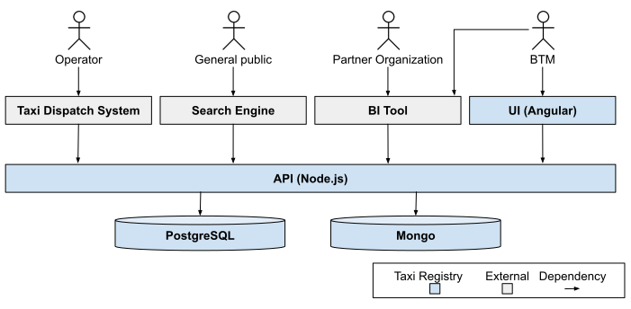
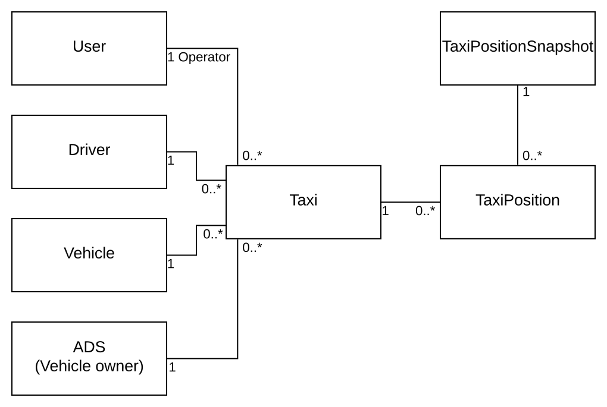
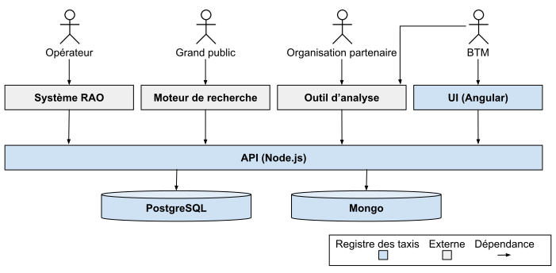

([Français](#french-version))

# montreal-taxi-registry

## Foreword

The Taxi Registry was created specifically for the City of Montréal. This is not a generic product that can easily be adapted to another city.

## Description

In 2018, the City of Montréal and the BTM officially launched the Taxi Registry, an ambitious technological project. This innovative platform gathers real-time data on the location and availability of the taxis in service, with the fundamental aim of better positioning taxis as part of the urban transportation supply. The extremely valuable data from the Registry can contribute to good decision-making on personal mobility and implementing sustainable transportation solutions.

The Taxi Registry of the Ville de Montréal has two mains goals:

- Provide data and metrics about the taxi industry
- Open up new markets for the taxi industry

The taxi owners must transmit to the Registry the position and the status (e.g., occupied) of each taxi of their fleet every 5 seconds. The data is stored for a year and available for further analysis in order to better understand the taxi industry and allow decision making based on unbiased data.

Several taxi operators are located within the territory of Ville de Montréal. The existence of a registry allowing a customer to book a taxi based upon its geographical location and not from a specific taxi operator brings new opportunities that will enhance and modernize the taxi offer in Montréal. For instance, by integrating the taxi offer with multimodal platforms (e.g., [Transit](https://transitapp.com) or [Chrono](https://www.artm.quebec/application-mobile-chrono)).

At the beginning, the Taxi Registry was forked from [Le.Taxi](https://le.taxi). Le.Taxi was developped in France and [published as open source software](https://github.com/openmaraude). Starting June 2017, decision has been made to distance montreal-taxi-registry from Le.Taxi and the python API was entirely decommisioned in September 2020. Moreover, the electronic hailing feature has been dropped in favor of the deep link approach (see the [Operator's Guide](http://www.registretaximontreal.ca/documentation-technique/) section 4).

## System

## Players

### Operators

The taxi owners must interact with the Taxi Registry by way of a permitted operator. The [Operator's Guide ](http://www.registretaximontreal.ca/documentation-technique/)(Guide des opérateurs) details how to integrate a Taxi Dispatch System from an operator with the Taxi Registry.

Responsibilities:

- Update contextual data (vehicle information, drivers, etc.) every 24 hours.
- Allow the taxi owner to conform to their legal obligation. Thus, the operators must transmit the position and status of every taxi every 5 second.
- Allow the taxi drivers to receive ride requests from the Taxi Registry.

### General public

Every person (citizen, tourists, etc.) willing to electronically request a taxi in Montréal.

It is out of the scope of the Taxi Registry to directly interact with the general public, this responsibility is delegated to the search engines. The search engines (e.g., [Transit](http://www.registretaximontreal.ca/documentation-technique/), [Chrono](http://www.registretaximontreal.ca/documentation-technique/)) are responsible of the development and use of the mobile application allowing the general public to request a trip from the closest taxi. The mobile applications do not communicate directly with the Taxi Registry, they are doing so through the search engines servers approved by the BTM.

The Taxi Registry handles every search engine user as an anonymous user, in order to protect the general public privacy.

### Montréal Taxi Bureau (BTM)

The [BTM is the promoter of the Taxi Registry](http://www.registretaximontreal.ca/). As part of its dual mandate of supervision and development, the BTM is responsible for improving taxi transportation services in the city by improving the skills of drivers, their safety and that of users. The BTM is therefore managing structuring projects for the modernization of the taxi industry and developing various initiatives that will benefit both the industry and the City of Montréal.

Responsibilities:

- Validate the contextual data sent by the operators (vehicle informations, drivers, etc.).
- Analyze the contextual data when needed.
- Identify the status and location of all the taxis registered in Montréal.
- Provide the taxi inspectors with the information they require.
- Handle the Taxi Registry user base (Analysis tools, operators, search engines).

### Partnership

The taxi industry's data is restricted to only a few partners that are clearly identified.

Responsibilities:

- Periodically extract taxi registry data in order to do statistical studies.

## Components

### API

Technologies: Node.js, Express, TypeScript

Responsibilities:

- Receive the positions and status of all the taxis every 5 seconds.
- Manage contextual data (vehicle information, drivers, etc.).
- Support every user interface action.
- Allow for analytic tools to extract the Taxi Registry data.

The server to server authentication (e.g., search engine to API Node.js) is done using an api key over HTTPS and the user to server authentication is token based over HTTPS.

### PostgeSQL database

Responsibilities:

- Persist contextual data (vehicle information, drivers, etc.).
- Persist users' profiles (Operators, Search engines, Partners and BTM users).

### Mongo database

Responsibilities:

- Persist position history and status that are transmitted by the operators.
- Quickly access the most recent position and status of each taxi.
- Do geospatial requests.

### OSRM

Responsibilities:

- Uses the map of Quebec for routing
- Estimate distance and duration of the taxi to the user and user from point A to B

### The UI (User Interface)

Technologies: Angular, Angular Material, TypeScript

The user interface is exclusively for internal use by the BTM.

Responsibilities:

- Display contextual data (vehicle information, drivers, etc.).
- Export anonymized contextual data as csv.
- Display live positioning of taxis on a map.
- Display the trips history of a taxi on a map.
- User management.

There are two user profiles for the UI: administrator and inspector. The user management is only available for administrators, while everything else is accessible to both the administrators and inspectors.

### Data model

For a more in-depth description or each attribute, please refer to the [Operator's Guide ](http://www.registretaximontreal.ca/documentation-technique/)(Guide des opérateurs).

### User (Utilisateur)

Properties: name, email, api key, etc.

There are several user profiles: operator, search engine, external partner, BTM inspector and admin.

The Taxi Registry's data are partitioned by operator. The data from an operator regarding his drivers, vehicles, owners, taxis and their positions belong to him and he is the only one that can modify them. The data from an operator cannot be associated with the data from another operator.

Some owners (a new trend) are dealing with several operators (regular or drivers solutions providers) in order to receive taxi fares from several operators, thus receiving more fares. In this case, the data is submitted independently by each operator. For instance, in the Taxi Registry, the driver submitted by the operator A is a distinct driver from the driver submitted by the operator B even if they are actually one in reality.

### Driver (Chauffeur)

Properties: driver's license, name, etc.

### Vehicule (Véhicule)

Properties: licence plate, vehicle features, etc.

### ADS (Propriétaire du véhicule)

Properties: CTQ file number, name, etc.
ADS is a term inherited by Le.Taxi that refers to a parking permission - Autorisation De Stationner (ADS). Before [Bill 17](https://www.transports.gouv.qc.ca/fr/entreprises-partenaires/trpa/Pages/trpa.aspx), Ads was representing a taxi owner permit. Since the [Bill 17](https://www.transports.gouv.qc.ca/fr/entreprises-partenaires/trpa/Pages/trpa.aspx), ADS is now representing the taxi owner himself, since the information on the owner permit is not relevant anymore.

### Taxi

A taxi is defined by the relation between a driver, a vehicle, an owner and an operator.

If any member of the association changes, then it is a different taxi.
For instance:

- Two drivers driving the same vehicle alternatively
- A vehicle being sold to a new owner
- A new licence plate is issued to the vehicle
- The owner is dealing with a new operator

### TaxiPosition

Properties: lon, lat, status, speed, etc.
The position for a taxi and other information that must be transmitted to the Taxi Registry every 5 seconds.

### TaxiPositionSnapshot

The operators must send the positions from all their taxis to the Taxi Registry as a batch. Each batch contains the taxi positions from one operator at a given time.

## Build

In order to run, Node.js must be installed on the machine.

Check that the version of Node.js installed on your machine matches the one mentioned in the `engine` section of the [package.json](./le-taxi-api-node.js/package.json) file.

Note: The UI is running with Node.js version 10.15 only.

### Api Node.js

From the directory `./le-taxi-api-node.js`:

To configure, copy the template `config/local.yaml.template` to `config/local.yaml` and fill the required information.

To install, run `npm install`.

To execute, run `npm run start-localhost`.

### User interface

Make sure you are using Node.js version 10.15 to run the user interface.

From the directory `./le-taxi-angular-ui`:

To install, run `npm install`.

To execute, run `npm run serve:local`.

Note: The Node.js API must be running to execute the user interface.

To create the user `<admin-user>`, you can tweak the script [Postgres 1.0.7](./le-taxi-api-node.js/src/databaseMigrations/postgres/afterSemver/pg_1_0_7_set_admin_password.ts). The password must be encrypted with the secret listed in the API Node.js configuration file (see the [encrypt function](./le-taxi-api-node.js/src/libs/security.ts) for the required format). Once the UI is running, you should be able to log in with the `<admin-user>` user and the password previously generated. From there, you can navigate to the user `Utilisateurs` page. You should be able to create new users and generate new passwords and apikeys.

## Testing

### API Tests

Technologies: Node.js, Vitest, Chai, TypeScript

The behavior of the taxi registry is mainly checked using API tests. These tests are using the [@villedemontreal/concurrent-api-tests](https://github.com/VilledeMontreal/concurrent-api-tests) library and the approach described in [Concurrent API Tests](https://stle-code.medium.com/concurrent-api-tests-d84f7a29f0dc?source=friends_link&sk=843339381eaf77195f8522449c907550), in order to have reliable, maintainable and fast tests to run.

From the directory `./le-taxi-api-tests`:

To configure, copy the template `config/local.yaml.template` to `config/local.yaml` and fill the required information.

To install, run `npm install`.

To Execute, run `npm run all-tests-localhost`.

Note: The Node.js API must be running to execute the API tests.

### Integration Tests (legacy)

Technologies: Node.js, Vitest, Chai, TypeScript

Unit tests allow us to validate the behavior of a few functions that would otherwise be difficult to test using the API; such as caches of date utils functions.

From the directory `./le-taxi-api-tests`:

Run the creation of a shared state file then follow the instructions: `npm run generate-integration-tests-shared-state`.

Once the file copied, you will be able to run the unit tests at will.

Then, from the directory `./le-taxi-api-node.js`:

To execute, run `npm run test-localhost`.

### Load Tests

Technologies: Node.js, Artillery, TypeScript

The load tests allows us to validate that we can support the expected load on the two most critical functions of the Registry, that is positions ingest and taxi search.

From the directory `./le-taxi-api-tests`:

To install, run `npm install`.

#### For the taxi positions ingest

In order to run the load tests, some taxis must be generated in advance. You can do so by running `npm run load-test-position-snapshots-generate-shared-state`.
Note that this process can take several minutes. Once done, you will be able to run the load tests at will.

To run the load tests for the taxi position ingest, run:

- `npm run load-test-position-snapshots-with-25-operators-200-taxis` to simulate 300 000 positions in 5 minutes.
- `npm run load-test-position-snapshots-with-50-operators-200-taxis` to simulate 600 000 positions in 5 minutes.

#### For the taxi search

First run `npm run load-test-generate-shared-state` to prepare to run tests.

In order to run the load tests for the taxi search, you should run the taxi position ingest first so that taxi are available during the test, then:

- `npm run load-test-300-inquiry` to simulate 300 requêtes in 5 minutes.
- `npm run load-test-1200-inquiry` to simulate 1200 requêtes in 5 minutes.

Note: The Node.js API must be running to execute the load tests.

## License

The source code of this project is distributed under the [GNU Affero License](LICENSE).

## Contributing

See [CONTRIBUTING.md](CONTRIBUTING.md#english-version).

## Code of Conduct

Participation in this poject is governed by the [Code of Conduct](CODE_OF_CONDUCT.md).

## Acknowledgements

The Taxi Registry team from the Ville de Montréal wants to thank the project [Le.Taxi](https://le.taxi) and the [associated source code](https://github.com/openmaraude) which was a great inspiration.

---

([English](#english-version))

# montreal-taxi-registry - Le Registre des taxis de la Ville de Montréal

## Avant-propos

Le Registre des taxis a été conçu spécifiquement pour la Ville de Montréal. Ce n’est pas un produit générique pouvant s'implanter automatiquement à une autre ville.

## Description

En 2018, la Ville de Montréal et le BTM lançaient officiellement le Registre des taxis, un ambitieux projet technologique. Cette plateforme innovante collecte des données en temps réel sur la localisation et la disponibilité des taxis en service, avec pour objectif fondamental de mieux positionner les taxis dans l'offre de transport urbain. Les données extrêmement précieuses du Registre peuvent contribuer à une bonne prise de décision sur la mobilité personnelle et à la mise en œuvre de solutions de transport durable.

Le Registre des taxis de Montréal a deux principaux objectifs:

- Recueillir des données et des métriques sur l’industrie du taxi
- Ouvrir de nouveaux marchés à l'industrie du taxi

Les propriétaires de taxis doivent transmettre au Registre la position et le statut (ex: occupé) de leurs taxis toutes les 5 secondes. Les données sont conservées pour un an et mises à la disposition de différents outils d’analyse. Ces analyses permettront de mieux comprendre l’industrie du taxi et de permettre la prise de décisions basées sur des données objectives.

De nombreuses compagnies de taxis opèrent sur le territoire de la Ville de Montréal. L’existence d’un registre permettant de demander un taxi en fonction de son emplacement géographique et non en fonction d’une compagnie spécifique offre de nouvelles possibilités d’innovations qui viendront bonifier et moderniser l’offre de taxis à Montréal. Par exemple, en intégrant l’offre de taxis à des solutions de transport multimodal (ex: [Transit](https://transitapp.com), [Chrono](https://www.artm.quebec/application-mobile-chrono)).

Au départ, le Registre des taxis était basé sur [Le.Taxi](https://le.taxi). Le.Taxi a été développé en France et [publié en libre](https://github.com/openmaraude). Dès juin 2017, la décision de s'éloigner de Le.taxi a été prise et l’Api Python est complètement décommissionné depuis septembre 2020. De plus, la fonctionnalité de hélage électronique à été abandonnée en faveur de l'approche par deep link (voir le [guide de l'opérateur](http://www.registretaximontreal.ca/documentation-technique/) section 4).

## Système

## Acteurs

### Opérateur

Les propriétaires de taxis doivent interagir avec le Registre des taxis via un opérateur autorisé. Le [guide de l'opérateur](http://www.registretaximontreal.ca/documentation-technique/) décrit en détail comment intégrer le système de répartition assisté par ordinateur (RAO) d'un opérateur avec le Registre des taxis.

Responsabilités:

- Mettre à jour les données contextuelles (information sur véhicules, chauffeurs, etc.) toutes les 24 heures.
- Permettre aux propriétaires de taxi de se conformer à leur obligation légale. Pour ce faire, les opérateurs doivent transmettre la position et le statut de l’ensemble des taxis avec lesquels ils font affaire toutes les 5 secondes.
- Permettre aux chauffeurs de taxi de recevoir des demandes à partir du Registre des taxis.

### Grand public

Toutes personnes (citoyens, touristes, etc.) désirant demander électroniquement un taxi à Montréal.

Il est hors du mandat du Registre des taxis d’interagir directement avec le grand public, cette responsabilité est déléguée aux moteurs de recherche. Les moteurs de recherche (ex: [Transit](http://www.registretaximontreal.ca/documentation-technique/), [Chrono](http://www.registretaximontreal.ca/documentation-technique/)) sont responsables du développement et de l’exploitation des applications mobiles permettant au grand public de demander une course avec le taxi le plus près. Les applications mobiles ne communiquent pas directement avec le Registre des taxis, elles le font via les serveurs des moteurs de recherche approuvés par le BTM.

Le Registre des taxis traite tous les utilisateurs d’un moteur de recherche comme un utilisateur anonyme, afin de protéger la vie privée du grand public.

### Le Bureau du Taxi de Montréal (BTM)

Le [BTM est le promoteur du Registre des taxis](http://www.registretaximontreal.ca/). Dans le cadre de son double mandat d’encadrement et de développement, le BTM détient notamment le mandat de bonifier les services de transport par taxi de la métropole en améliorant les compétences des chauffeurs, leur sécurité ainsi que celle des usagers. Ainsi, le BTM pilote des projets de modernisation structurants pour l’industrie du taxi et développe différentes initiatives porteuses tant pour l’industrie que pour la Ville de Montréal.

Responsabilités:

- Valider les données contextuelles transmises par les opérateurs (information sur véhicules, chauffeurs, etc.).
- Analyser les données contextuelles de manière ad hoc.
- Être en mesure de savoir la position et le statut de chacun des taxis en service à Montréal.
- Répondre aux demandes d’information des inspecteurs de taxi.
- Gérer les utilisateurs du Registre des taxis (Opérateurs, moteurs de recherche et organisation partenaire).

### Organisation partenaire

L’ouverture des données du Registre des taxis est restreinte à certaines organisations partenaires bien identifiées.

Responsabilités:

- Extraire périodiquement les données du Registre des taxis, afin d'effectuer des études statistiques.

## Composantes

### API

Technologie: Node.js, Express, TypeScript

Responsabilités:

- Recevoir la position et le statut de l’ensemble des taxis toutes les 5 secondes.
- Gestion des données contextuelles (information sur véhicules, chauffeurs, etc.).
- Supporter l’ensemble des opérations de l’interface usager.
- Permettre aux outils d’analyse d’extraire l’ensemble des données du registre des taxis.

L’authentification de serveur à serveur (ex: moteur de recherche vers API Node.js) s’effectue via api key sur HTTPS et l’authentification utilisateur à serveur s’effectue via token sur HTTPS.

### Base de données PostgreSQL

Responsabilités:

- Persister les données contextuelles (information sur véhicules, chauffeurs, etc.).
- Persister les profils utilisateurs (Opérateurs, Moteurs de recherche, Organisations partenaires et utilisateur BTM).

### Base de données Mongo

Responsabilités:

- Persister l’historique des positions et statuts des taxis transmis par les opérateurs.
- Accès rapide à la position et au statut le plus récent de chacun des taxis.
- Effectuer des requêtes géospatiales.

### OSRM

Responsabilités:

- Utilises la carte du Québec pour le routage
- Estime la distance et la durée que le taxi met pour se rendre à l'utilisateur et l'utilisateur aller du point A au point B

### UI (Interface usager)

Technologie: Angular, Angular Material, TypeScript

L'interface usager est exclusivement pour un usage interne par le Bureau du Taxi de Montréal.

Responsabilités:

- Visualisation des données contextuelles (information sur véhicules, chauffeurs, etc.).
- Export les données contextuelles anonymisées en csv.
- Suivi des taxis en temps réel sur une carte.
- Visualiser l'historique des trajets d'un taxi sur une carte.
- Gestion des utilisateurs.

Il existe deux profils d’utilisateurs: administrateur et inspecteur. La gestion des utilisateurs est réservée aux administrateurs tandis que le reste est accessible tant aux administrateurs qu’aux inspecteurs.

## Modèle de données

Pour une description exhaustive de chaque attribut traité par le Registre des taxis, veuillez consulter le [guide de l'opérateur](http://www.registretaximontreal.ca/documentation-technique/).

### User (Utilisateur)

Attributs: nom, courriel, api key, etc.

Il existe plusieurs profils d’utilisateurs: opérateur, moteur de recherche, partenaire externe, inspecteur BTM et admin.

Les données du Registre des taxis sont partitionnées par opérateur. Les données d’un opérateur sur ses chauffeurs, ses véhicules, ses propriétaires, ses taxis et leurs positions lui appartiennent et il est le seul à pouvoir les modifier. Les données d’un opérateur ne peuvent pas être associées aux données d’un autre opérateur.

Certains propriétaires (une nouvelle tendance) font affaire avec plusieurs opérateurs (traditionnels ou fournisseurs de solutions chauffeurs) afin d’obtenir des courses de la part de plusieurs opérateurs et ainsi obtenir plus de courses. Dans ce cas, les données sont soumises de manière autonome par chacun des opérateurs. Par exemple, dans le Registre des taxis, le chauffeur soumis par l’opérateur A est un chauffeur distinct du chauffeur soumis par l’opérateur B même s’il s’agit du même chauffeur dans la réalité.

### Driver (Chauffeur)

Attributs: numéro de permis de conduire, nom, etc.

### Vehicule (Véhicule)

Attributs: plaque d’immatriculation, caractéristiques du véhicule, etc.

### Ads (Propriétaire du véhicule)

Attributs: numéro de dossier CTQ, nom, etc.
Ads est un terme hérité de Le.Taxi qui signifie: Autorisation De Stationner (ADS). Avant la [Loi 17](https://www.transports.gouv.qc.ca/fr/entreprises-partenaires/trpa/Pages/trpa.aspx), Ads représentait un permis de propriétaire de taxi. Depuis la [Loi 17](https://www.transports.gouv.qc.ca/fr/entreprises-partenaires/trpa/Pages/trpa.aspx), Ads représente le propriétaire en tant que tel, car l’information sur le permis de propriétaire n’est plus pertinente.

### Taxi

Un taxi représente l’association entre un chauffeur, un véhicule, un propriétaire et un opérateur.

Lorsqu’une de ces associations change, il ne s’agit plus du même taxi.
Par exemple:

- Deux chauffeurs conduisent le même véhicule à tour de rôle
- Un véhicule est vendu à un nouveau propriétaire
- Le véhicule change de plaque
- Le propriétaire fait affaire avec un nouvel opérateur

### TaxiPosition (Position d’un taxi)

Attributs: lon, lat, statut, vitesse, etc.
La position d’un taxi et d’autres informations doivent être transmises au Registre des taxis à chaque cinq secondes.

### TaxiPositionSnapshot (Lot de position de taxis)

Les opérateurs doivent transmettre les positions de tous les taxis au Registre des taxis en lot. Chaque lot contient les positions des taxis d’un opérateur à un instant donné.

## Bâtir

Pour exécuter, Node.js doit être installé sur la machine.

Vérifier que la version de Node.js mentionnée dans la section `engine` du fichier [package.json](./le-taxi-api-node.js/package.json) est disponible sur la machine.

Note: Attention, le UI s'exécute avec la version 10.15 de Node.js uniquement.

### Api Node.js

Depuis le répertoire `./le-taxi-api-node.js`:

Pour configurer, copier le gabarit `config/local.yaml.template` vers `config/local.yaml` et y renseigner les informations requises.

Pour installer, lancer la commande `npm install`.

Pour exécuter, lancer `npm run start-localhost`.

### Interface utilisateur

Assurez-vous d'utiliser la version 10.15 de Node.js pour exécuter le UI.

Depuis le répertoire `./le-taxi-angular-ui`:

Pour installer, lancer la commande `npm install`.

Pour exécuter, lancer `npm run serve:local`.

Note: L'Api Node.js doit être en train d'exécuter pour lancer l'interface utilisateur.

Pour créer un utilisateur `<admin-user>`, il est possible de s'inspirer du script [Postgres 1.0.7](./le-taxi-api-node.js/src/databaseMigrations/postgres/afterSemver/pg_1_0_7_set_admin_password.ts). Le mot de passe doit être chiffré avec le secret renseigné dans le fichier de configuration de l'api Node.js (voir [fonction de chiffrement](./le-taxi-api-node.js/src/libs/security.ts) pour le format à respecter). Une fois le UI disponible, vous pourrez vous connecter avec l'utilisateur `<admin-user>` et le mot de passe précédemment généré. Ensuite, depuis la page `Utilisateurs` il vous sera possible de créer d'autres utilisateurs et de générer de nouveaux mots de passe et/ou apikeys.

## Tester

### Tests d'API

Technologie: Node.js, Vitest, Chai, TypeScript

Le bon fonctionnement du Registre des taxis est principalement vérifié à l'aide de tests d'API. Ces tests utilisent la librairie [@villedemontreal/concurrent-api-tests](https://github.com/VilledeMontreal/concurrent-api-tests) et l'approche décrite dans [Concurrent API Tests](https://stle-code.medium.com/concurrent-api-tests-d84f7a29f0dc?source=friends_link&sk=843339381eaf77195f8522449c907550), afin d'obtenir des tests fiables, maintenables et rapides à exécuter.

Depuis le répertoire `./le-taxi-api-tests`:

Pour configurer, copier le gabarit `config/local.yaml.template` vers `config/local.yaml` et y renseigner les informations requises.

Pour installer, lancer la commande `npm install`.

Pour exécuter, lancer `npm run all-tests-localhost`.

Note: L'Api Node.js doit être en train d'exécuter pour lancer les tests d'API.

### Tests d'intégration (legacy)

Technologie: Node.js, Vitest, Chai, TypeScript

Les tests unitaires permettent de valider le comportement de certaines fonctions qu'il serait difficile de tester via l'API; comme par exemple des caches ou les fonctions utilitaires de manipulation de dates.

Depuis le répertoire `./le-taxi-api-tests`:

Lancer la création d'un fichier d'état partagé puis suivre les instructions: `npm run generate-integration-tests-shared-state`.

Une fois le fichier copié, vous pourrez exécuter les tests unitaires à l'envie.

Ensuite, depuis le répertoire `./le-taxi-api-node.js`:

Pour exécuter, lancer `npm run test-localhost`.

### Tests de charge

Technologie: Node.js, Artillery, TypeScript

Les tests de charge permettent de valider la charge attendue sur les deux fonctions les plus critiques du Registre, l'ingestion de positions de taxis et la recherche de taxis.

Depuis le répertoire `./le-taxi-api-tests`:

Pour installer, lancer la commande `npm install`.

#### Pour les tests d'ingestion de positions

Afin de pouvoir exécuter les tests de charges, des taxis ont besoin d'être générés en avance. Cela se fait via la commande `npm run load-test-position-snapshots-generate-shared-state`. À noter que cette commande peut prendre plusieurs minutes. Une fois complétée, vous pourrez exécuter les tests de charge à l'envie.

Pour exécuter les tests de charge pour l'ingestion des positions de taxis, lancer:

- `npm run load-test-position-snapshots-with-25-operators-200-taxis` pour simuler 300 000 positions en 5 minutes.
- `npm run load-test-position-snapshots-with-50-operators-200-taxis` pour simuler 600 000 positions en 5 minutes.

#### Pour les tests de recherche de taxis

Lancer au préalable la commande `npm run load-test-generate-shared-state` afin de préparer à l'exécution des tests.

Pour exécuter les tests de charge pour la recherche de taxis, il faut dans un premier temps exécuter les tests d'ingestion de positions afin d'avoir des taxis disponibles pendant le test, puis:

- `npm run load-test-300-inquiry` pour simuler 300 requêtes en 5 minutes.
- `npm run load-test-1200-inquiry` pour simuler 1200 requêtes en 5 minutes.

Note: L'Api Node.js doit être en train d'exécuter pour lancer les tests de charge.

## Contribuer

Voir [CONTRIBUTING.md](CONTRIBUTING.md#french-version)

## Licence et propriété intellectuelle

Le code source de ce projet est libéré sous la licence [GNU Affero License](LICENSE).

## Code de Conduite

La participation à ce projet est réglementée part le [Code de Conduite](CODE_OF_CONDUCT.md#french-version)

## Remerciements

L'équipe du Registre des taxis de la Ville de Montréal souhaite remercier particulièrement le projet [Le.Taxi](https://le.taxi) et le [code source associé](https://github.com/openmaraude) dont elle a pu grandement s'inspirer.
